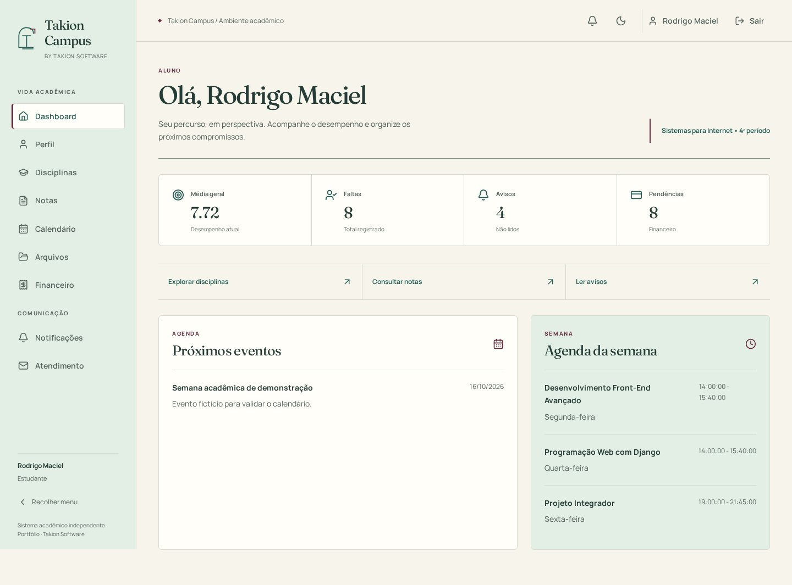
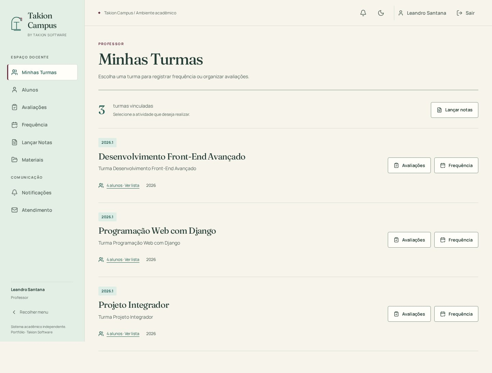
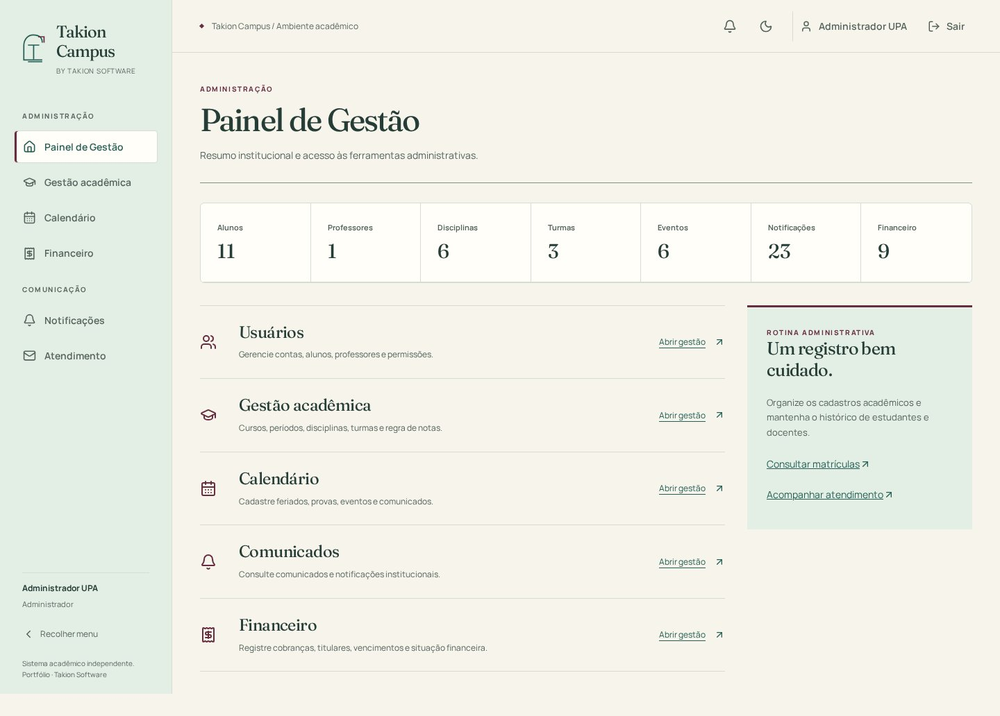

# Takion Campus — revisão visual e evidências

Este é o registro histórico do PR #21, anterior à reconciliação com a main. Seus resultados e contagens não representam uma nova execução da integração. Consulte [evidências atuais](INTEGRATION_EVIDENCE.md) e [estado verificado](../INTEGRATION_STATUS.md) para os testes e limites desta branch.

Data: 10/10/2026. Sistema executado localmente com build de produção React, Chromium real e API Django/PostgreSQL 17. Dados e credenciais são fictícios do seed de demonstração. Nenhuma evidência representa implantação pública.

## Comparação antes/depois

A base é o commit `5c19d23` do PR #20. Capturas antigas foram obtidas antes da alteração do build; o login foi recapturado em checkout isolado desse commit, aguardando a página carregar, porque a primeira captura ainda mostrava o carregamento. As capturas novas usam o mesmo banco fictício. Os testes funcionais adicionam registros, portanto contagens entre imagens podem mudar; não representam métricas de impacto.

| Superfície | Antes | Takion Campus |
| --- | --- | --- |
| Login desktop, 1440 px | [Antes](evidence/before/login-1440.jpg) | [Depois](evidence/after/login-1440.jpg) |
| Login mobile, 390 px | [Antes](evidence/before/login-390.jpg) | [Depois](evidence/after/login-390.jpg) |
| Dashboard estudante | [Antes](evidence/before/student-1440.jpg) | [Depois](evidence/after/student-1440.jpg) |
| Turmas professor | [Antes](evidence/before/teacher-1440.jpg) | [Depois](evidence/after/teacher-1440.jpg) |
| Administração | [Antes](evidence/before/admin-1440.jpg) | [Depois](evidence/after/admin-1440.jpg) |
| Tabela de alunos | [Antes](evidence/before/table-1440.jpg) | [Depois](evidence/after/table-1440.jpg) |
| Perfil/formulário | [Antes](evidence/before/form-1440.jpg) | [Depois](evidence/after/form-1440.jpg) |
| Calendário | [Antes](evidence/before/calendar-1440.jpg) | [Depois](evidence/after/calendar-1440.jpg) |
| Tema escuro | [Antes](evidence/before/dark-1440.jpg) | [Depois](evidence/after/dark-1440.jpg) |








## Referências adicionais

[Recuperação](evidence/after/recovery-1440.jpg) · [Redefinição](evidence/after/reset-1440.jpg) · [Erro de login](evidence/after/login-error-390.jpg) · [Login escuro](evidence/after/login-dark-1440.jpg) · [Menu mobile](evidence/after/navigation-390.jpg) · [Estudante mobile](evidence/after/student-390.jpg) · [Professor mobile](evidence/after/teacher-390.jpg) · [Administrador mobile](evidence/after/admin-390.jpg) · [Disciplinas](evidence/after/subjects-1440.jpg) · [Notas](evidence/after/grades-1440.jpg) · [Notificações](evidence/after/notifications-1440.jpg) · [Arquivos](evidence/after/files-1440.jpg) · [Financeiro](evidence/after/financial-1440.jpg) · [Atendimento](evidence/after/contact-1440.jpg) · [Frequência](evidence/after/attendance-1440.jpg) · [Avaliações](evidence/after/assessments-1440.jpg) · [Gestão](evidence/after/management-1440.jpg) · [404](evidence/after/404-1440.jpg).

## Matriz de responsividade

`frontend/e2e/design.spec.js` percorre 40 combinações de página/perfil: 4 públicas, 10 estudante, 9 professor e 17 administrador, incluindo as 13 seções de gestão. Cada combinação é visitada nos temas claro/escuro e em **320, 360, 390, 430, 768, 1024, 1366, 1440, 1920, 2560 e 3840 px**. Isso corresponde a 880 verificações de composição/overflow em navegador. As tabelas conservam rolagem horizontal dentro de regiões próprias; a página não ganha rolagem horizontal.

Os testes verificam H1 único, tema aplicado, marca, largura do documento e controles essenciais fora das tabelas. Em 320/1440 px executam axe nos dois temas, totalizando 160 auditorias automatizadas da matriz. Capturas de cada combinação em 1440 px/claro e JSON com dimensões são anexados ao relatório Playwright. A navegação recolhida, indicação de seção, trap de foco, Escape, skip link e redução de movimento possuem cenários próprios.

A ampliação de texto a 200% usa a fonte raiz e verifica reflow de oito páginas de estudante em 640 px. `browser-zoom.spec.js` verifica **zoom real de 200% e 400%** pelo mecanismo `chrome.tabs.setZoom`, usando uma extensão exclusivamente de teste. Uma janela de 1280 px resulta em viewport CSS de 640/320 px e DPR de 2/4; não é CSS zoom. Percorre autenticação e áreas dos três perfis, com evidência JSON e capturas anexadas. As 37 rotas por perfil correspondem a 74 verificações de zoom. A extensão não integra o bundle nem é instalada para usuários.

## Acessibilidade e inspeção

Referência: WCAG 2.2 AA. Axe usa tags WCAG 2 A/AA, 2.1 A/AA e 2.2 AA. A inspeção verificou hierarquia, densidade, alinhamento, contraste, legibilidade, estados e navegação; capturas de referência estão acima. As regras de texto auxiliar e bordas de campos foram ajustadas durante QA.

| Par | Contraste calculado |
| --- | --- |
| Ação verde / superfície clara | 7,42:1 |
| Texto auxiliar / navegação mint | 5,00:1 |
| Borda de campo / superfície clara | 3,34:1 |
| Borda de campo / superfície escura | 3,16:1 |
| Ação mint / superfície escura | 9,32:1 |
| Foco rosé / fundo escuro | 9,29:1 |

São amostras dos tokens, calculadas pela luminância relativa sRGB; a verificação axe cobre os elementos renderizados. Não se declara certificação WCAG integral. Leitores de tela NVDA/VoiceOver, Safari/Firefox e dispositivos físicos não foram executados nesta sessão. A avaliação de usabilidade com pessoas permanece uma etapa externa.

## Resultado executado

O teste adicional de zoom real passou nas 74 combinações de rota/zoom verificadas. A suíte completa contém 79 cenários de navegador (32 funcionais anteriores, 46 de matriz/navegação/texto/movimento e um de zoom real). Os resultados consolidados e o commit verificado acompanham o PR na aba Checks; o workflow conserva relatório HTML, JSON, capturas e traces.

Verificações locais já executadas: 29 testes Node aprovados, lint aprovado, build de produção aprovado e npm audit com zero vulnerabilidades. A matriz completa de navegador é executada também no CI, contra banco de demonstração novo. O estado da revisão/merge permanece independente da aprovação dos testes.

## Reproduzir

Use o [README](../../README.md) para iniciar API, PostgreSQL ou SQLite e interface. Para replicar os testes de navegador, use o build de produção em `127.0.0.1:5173`, API em `127.0.0.1:8000`, `VITE_API_URL=http://127.0.0.1:8000/api`, seed fictício e variáveis de cookie/CSRF/limitação do job `e2e` em `.github/workflows/backend-checks.yml`.

```bash
cd frontend
npm ci
npx playwright install --with-deps chromium
npm run lint
npm test
VITE_API_URL=http://127.0.0.1:8000/api npm run build
npm run preview -- --host 127.0.0.1 --port 5173 --strictPort
# Com API e preview em execução, em outro terminal:
npm run test:e2e
npx playwright show-report
```

O workflow de PR executa esses cenários sobre API e PostgreSQL reais, com dados fictícios isolados; guarda relatório/capturas/trace por 14 dias. Os testes de Django continuam na pipeline para proteger os contratos preservados, embora esta entrega não altere o Back-End.
