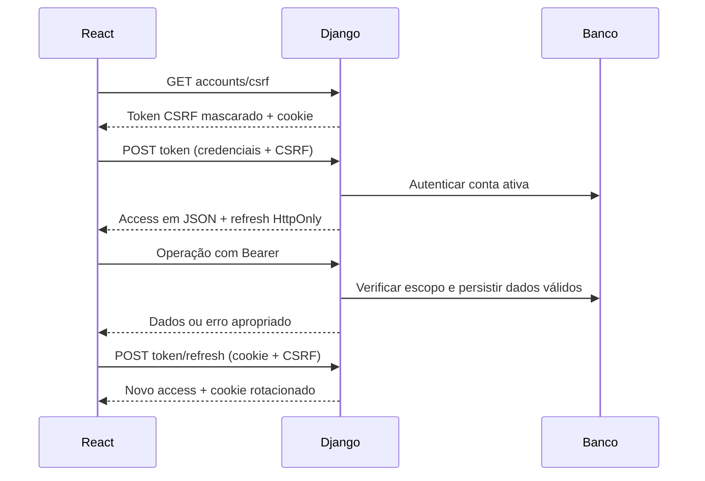

# Referência técnica — UPA Portal Acadêmico

Esta referência descreve a implementação da release 2.1.0-rc.1. As evidências executadas estão em [RELEASE.md](RELEASE.md); configuração e operação estão em [OPERATIONS.md](OPERATIONS.md).

## Contrato e perfis

A API usa `/api/`, JWT de curta duração e cookie de renovação. A interface recebe os papéis de `/accounts/me/`. `is_staff` representa a administração; o grupo `Professor` representa docentes; demais contas usam os recursos estudantis conforme seu perfil e matrícula. O grupo `Administrador` sozinho não concede privilégios.

| Área | Recursos |
| --- | --- |
| Contas | `GET /accounts/csrf/`, `GET /accounts/me/`, `/accounts/users/`, `/accounts/reset-password/`, `/accounts/reset-password/{uid}/{token}/` |
| Sessão | `POST /token/`, `POST /token/refresh/`, `POST /token/logout/` |
| Acadêmico | `/academic/courses/`, `/academic/terms/`, `/academic/students/`, `/academic/teachers/`, `/academic/subjects/`, `/academic/class-groups/`, `/academic/class-enrollments/` |
| Registros | `/academic/grades/`, `/academic/grade-policy/`, `/academic/assessments/`, `/academic/assessment-results/`, `/academic/attendance/`, `POST /academic/attendance/batch/` |
| Agenda | `/academic/calendar/`, `/academic/weekly-schedule/` |
| Operação | `/files/`, `/files/{id}/download/`, `/contact/`, `/financial/`, `/notifications/`, `/notifications/{id}/mark_as_read/` |
| Painel | `GET /dashboard/summary/`, com resposta correspondente ao perfil |

Listas mantêm o contrato de array; o parâmetro `page` ativa `{count,next,previous,results}`. Filtros por IDs positivos e data retornam 400 se inválidos. Operação sem autenticação retorna 401; sem permissão retorna 403; registro fora do escopo retorna 404; exclusão de referência protegida e conflito de integridade retornam 409.

## Cadastro administrativo

1. Criar conta com usuário, senha inicial validada e perfil de acesso.
2. Para estudante, cadastrar perfil com `user`, `registration`, `course_id` e `semester`. O campo `course` continua representando o nome do curso na leitura.
3. Para professor, cadastrar `user`, `employee_code`, departamento e titulação.
4. Criar período, disciplina e turma, vinculando professor e período.
5. Matricular estudantes e cadastrar horários compatíveis com disciplina/professor da turma.
6. Criar cobranças e comunicados escolhendo seu titular/destinatário.

Somente superusuários concedem administração ou alteram contas administrativas. Não há DELETE de usuários na API; use desativação. A própria conta não pode remover seu acesso administrativo. Vínculos de perfis não podem ser transferidos para outra conta nem trocar de papel apagando seu histórico.

## Regras acadêmicas

- Disciplina representa o catálogo; professor e período pertencem à oferta/turma.
- Matrícula é única por estudante/turma. Notas vinculadas são únicas por estudante/disciplina/turma/tentativa; notas históricas sem turma são únicas por estudante/disciplina/tentativa.
- Notas finais vão de 0 a 10. Avaliações têm peso e máximo positivos; resultados não podem exceder o máximo.
- Resultados das avaliações regulares geram a tentativa 1; avaliações de recuperação geram a tentativa 2. A média pondera notas normalizadas para 10 pelos pesos dos resultados registrados. Avaliações ainda sem resultado não entram na média; não representam zero automático.
- Frequência recalcula faltas da turma e situação acadêmica. O limite de faltas, quando definido, reprova acima do limite. Notas antigas sem turma preservam faltas manuais.
- A chamada em lote exige estudantes ativos, rejeita duplicatas e grava atomicamente. Reenvio na mesma turma/data atualiza registros; datas com múltiplas sessões históricas exigem edição individual pela API.
- Notas vinculadas são consultadas pelo docente e alteradas pelas avaliações; não são editadas manualmente na interface docente.
- Avaliação com resultados não pode mudar de turma; a nota máxima não pode ficar abaixo de resultados registrados. Mudança de disciplina em turma com registros exige nova oferta.
- Exclusões em lote de resultados/frequências pelo Django Admin também recalculam os valores derivados, por sinais de exclusão.

## Arquivos e atendimento

Professores publicam material/atividade somente em suas turmas. Estudantes consultam materiais de turmas matriculadas e suas próprias entregas/documentos. Entregas vinculadas a atividade usam a mesma turma e respeitam o prazo. Docentes podem registrar devolutiva; colegas não podem ler entregas de outros estudantes.

Os formatos permitidos são PDF, PNG, JPG, TXT, DOCX, XLSX e PPTX, até 25 MB por padrão. Validação de formato não é um antivírus; análise de malware e políticas de retenção devem integrar a operação institucional. Arquivos ficam em armazenamento privado e são retornados como anexos após autorização.

Atendimento gera UUID de protocolo e persiste situação, mensagem, resposta e datas. Somente administração responde; solicitante lê seu histórico. O financeiro mantém registros administrativos e não integra um provedor de pagamentos.

## Sessão

Troca de senha invalida access e refresh antigos; blacklist impede reutilização de refresh após rotação/logout. Access emitido antes de logout pode durar até seus 15 minutos de validade, pois logout revoga refresh; troca de senha/desativação são as medidas para revogação total da conta. Proteção CSRF também cobre login. SMTP de produção depende de configuração externa; o teste de navegador usa arquivo local.
